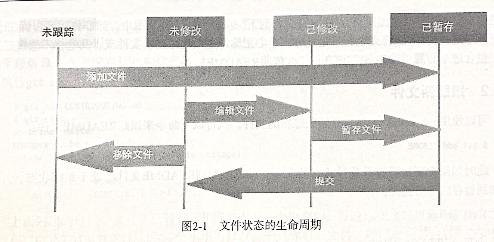
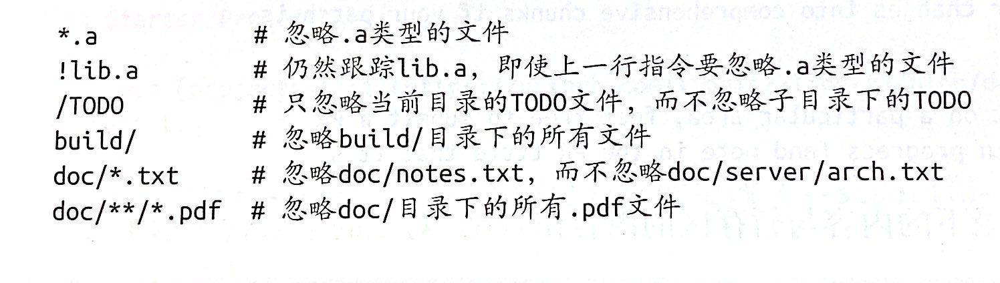
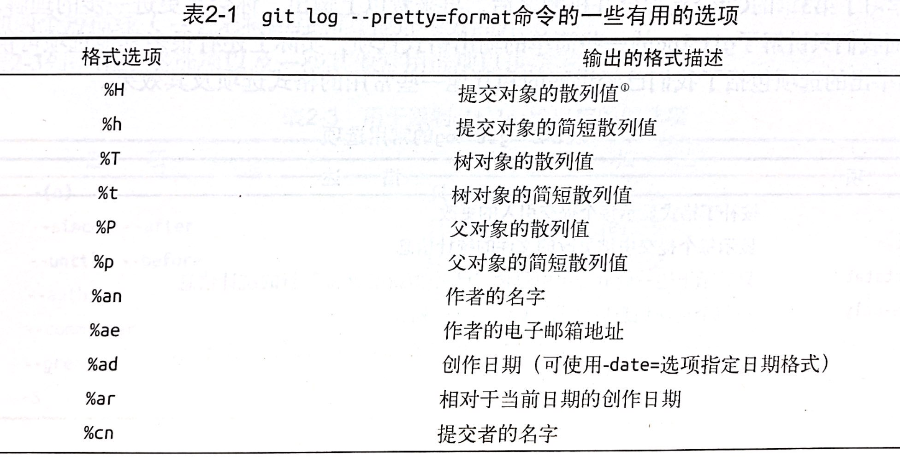
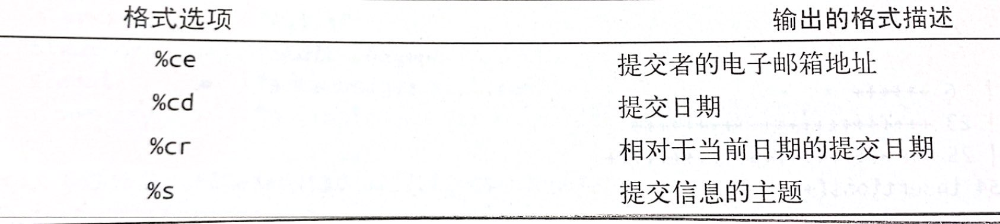
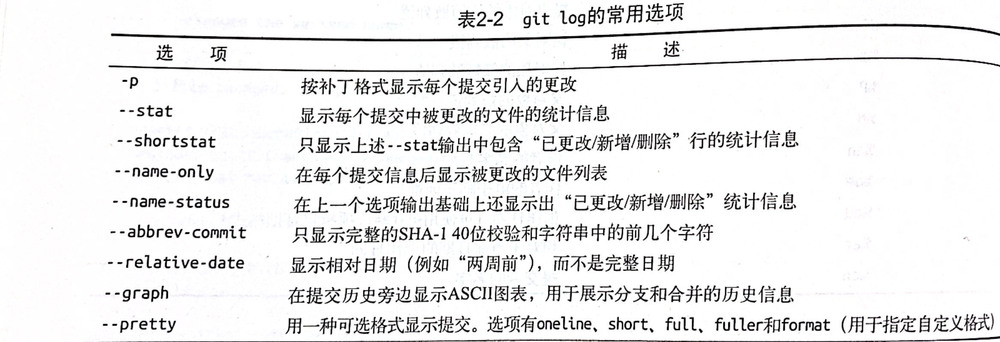

# Git学习笔记

## 第二章

### 2.2 在Git仓库中记录变更

#### 1. 工作目录中的没一个文件都处于两种状态之一

- 已跟踪：上一次快照中包含的文件。
  - 未修改
  - 已修改
  - 已暂存
- 未跟踪：除去已跟踪文件之外的所有文件。也就是不在上一次快照中，也不在暂存区中的文件。



当刚刚完成仓库克隆时，所有文件的状态都是已跟踪且为修改的。

#### 2. 查看当前文件状态

```shell
$git status  #将所有信息都输出

$git status -s   #输出简短的信息，通过文件名前的符号来确定文件的状态。
```

output:

```shell
 M README
MM Rakefile
A  lib/git.rb
M  lib/simplegit.rb
?? LICENSE.txt
```

文件的状态是通过两列字符来确定的。左列字符标明文件是否已暂存，右列字符表明文件是否已修改。

左列有字符表明已暂存，右列有字符表明已修改。（一般为M）。如：lib/simplegit.rb是已修改且已暂存的文件;Rakefile是已修改并被添加到暂存区，之后又被修改过。
左列可以抽象为暂存区，右列可以抽象为工作区。

？？表明未被跟踪的新文件

A&nbsp;&nbsp;&nbsp;&nbsp;&nbsp;&nbsp;表明已暂存的新文件

#### 3. 跟踪新文件以及暂存已修改的文件

```shell
$git add
```

git add 命令意指添加内容到下一次提交中，即文件状态为已暂存，如果是新文件，还会更改为已跟踪状态。

#### 4. 忽略文件

在文件`.gitignore`中列出待匹配文件的模式，凡是与该文件中的模式相匹配的文件都会被git忽略。

可以写入.gitignore文件中的匹配模式的规则如下：

- 空行或者以#开始的行会被忽略
- 支持标准的glob模式（glob模式类似于shell所使用的简化版正则表达式）
- 以斜杠（/）开头的模式可用于禁止递归匹配
- 以斜杠（/）结尾的模式表示目录
- 以感叹号（！）开始的模式表示取反



#### 5. 查看已暂存和未暂存的变更

```shell
$git diff
```

可以显示尚未添加到暂存区的变更（与咱存区中的内容相比较）

```shell
$git diff --staged  #--cached同义
```

查看哪些已暂存的内容会进入下一次提交（暂存区中修改的部分），会将暂存区中的文件与上一次提交的的内容想比较。

#### 6. 提交变更

```shell
$git commit
```

可以将暂存区中的变更都提交到Git目录中。未暂存的变更都不会进入到提交的内容中：任何编辑之后没有执行`git add`命令添加到暂存区的新建或修改过的文件。

提交变更需要添加变更信息，使用`git commit`命令之后会打开你的指定的编辑器，可以编辑变更信息。保存了变更信息才能提交变更成功。

使用`git commit`提交变更中默认的提交信息会包括被注释掉的`git status`命令的最新输出结果

通过添加参数`-v`，即`git commit -v`会把这次提交的差异对比显示在文本编辑器中。即`git diff --staged`

通过`-m`选项可以在命令行中键入提交信息

```shell
$git commit -m "msg..."
```

通过这种方式提交不会再打开默认编辑器，而是直接提交结果。

#### 7. 跳过暂存区

```shell
$git commit -a
```

给`git commit`命令传入`-a`选项，就能让Git自动把已跟踪的所有文件（当然是修改过的）添加到暂存区，然后再提交。

#### 8. 移除文件

```shell
$git rm
```

该命令会把指定文件从已跟踪文件列表中移除（确切地说，是从暂存区中移除）

1. 如果已经添加到暂存区的文件，可以先删除硬盘上的文件，再使用`git rm 文件名`删除暂存区中的记录。下一次提交时，这个文件就不存在了，也不会再被Git跟踪管理。

2. 使用`git rm -f 文件名`可以删除已加入到了索引（已暂存）中的文件。且必须添加`-f`选项进行强制移除。

3. 如果想要从暂存区中删除文件记录，并不让Git对其进行跟踪管理，但是想要将文件继续保留在硬盘上。如日志文件和编译生成的文件。只需要使用`--cached`选项即可。

可以将文件、目录和文件的glob模式传递给git rm命令。
《精通Git（第2版）》一书中的例子：

```shell
$git rm log/\*.log
```

书中说反斜杠（\）是必需的，这是因为shell和Git先后都要处理文件名拓展。
但是，我在Ubuntu18中使用git过程中，不使用反斜杠（\）也是可以的。

#### 9. 移动文件

```shell
$git mv file_from file_to
```

相当于执行了下面三条命令：

```shell
$mv file_from file_to
$git rm file_from
$git add file_to
```

#### 10. 查看提交历史

```shell
$git log
```

参数选项：

- -p：显示出每次提交所引入的差异。
- -\<n\>：只输出最近的n次提交。n可以是任意整数。
- --stat：查看每个提交的简要统计信息。
- --pretty:可以更改日志输出的默认格式。Git预留了一些格式

  - --oneline：在一行中显示一个提交。
  - short、full和fuller会分别比默认输入减少或增加一些信息。
  - format：可以指定自己的输出格式。

  
  

- --graph：会用ASCII字符形式的简单图表来显示Git分支和合并历史。



限制提交历史的输出范围

使用例子：

```shell
git log --since=2 weeks  #列出最近两周内的所有提交，可以使用具体日期，也可以使用相对时间。
```

如果需要多个条件都满足才显示则需要添加`--all-match`参数。

`git log 文件路径`：可以给log命令指定一个目录名或者文件名，那么就可以只输出更改了指定文件的那些提交。

### 2.3 撤销操作

场景：提交后发现忘了添加某些文件，或者写错了提交信息。如果想要重新尝试提交，可以使用`--amend`选项：(amend意为修正)

```shell
git commit --amend
```

使用了`--amend`选项，也会打开编辑器对提交信息进行编辑，但是此次编辑器中会有上一次添加的提交信息。可以对其进行更改。

例如：

假设你提交后才意识到忘记了添加某个之前更改过的文件，可以执行类似下面的操作：

```shell
git commit -m "initial commit"
git add forgotten_file
git commit --amend
```

这系列命令最终只是产生了一个提交，第二个提交命令修正了第一个提交的结果。

#### 撤销已暂存的文件

```shell
git reset 文件名
```

会把文件移出暂存区，回溯到已修改未暂存的状态。

#### 撤销对文件的修改

```shell
git checkout -- 文件名
```

会舍弃未暂存的指定文件，并将Git目录中的文件检出覆盖当前工作目录中的文件。

### 2.4 远程仓库的使用

#### 1. 显示远程仓库

使用`git remote`会列出每个远程仓库的简短名称。

使用`-v`参数可以显示出Git存储的每个远程仓库对应的URL。

#### 2. 添加远程仓库

```shell
git remote add [shortname] [url]
```

可以在命令行中使用shortname替代完整的URL

#### 3. 从远程仓库获取和拉取数据

获取数据：

```shell
git fetch [remote-name] #你设置的shortname
```

该命令会获取到所有自上一次克隆（或获取）之后被推送到服务器端的新增的变更数据。

注意：`git fetch`只会把数据拉取到本地仓库，并不会自动将这些数据合并到本地的工作成果中，也不会修改当前工作目录下的任何数据。需要手动将这些数据合并到本地内容中。

可以使用`git pull`命令来自动获取远程数据，并将数据分支合并入当前本地分支。

默认情况下，`git cline`命令会自动设置你的本地master分支，使其跟踪被克隆的服务器端的master分支。

#### 4. 将数据推送到远程仓库

命令格式：

```shell
git push [remote-name] [branch-name]
```

如果想把本地的master分支推送到远程的origin服务器上

```shell
git push origin master
```markdown

推送前提：

1. 拥有仓库的写权限。
2. 在你拉取和推送之间没有其他用户推送了新版本，否则，需要先整合其他用户推送内容才能推送。

#### 5. 检查远程仓库

命令：

```shell
git remote show [remote-name]
```

查看某一远程仓库的更多信息。

#### 6. 删除和重命名远程仓库

命令：

```shell
#重命名
git remote rename old_name new_name
#删除
git remote rm remote_name
```

### 5. 标记

#### 1. 列举标签

列举可用标签：

```shell
git tag
```

查看指定系列标签

```shell
git tag -l "v1.8.5*" #会列出标签匹配的所有标签
```

#### 2. 创建标签

- 轻量（lightweight）标签:他只是一个指向某次提交的指针。
- 注释（annotated）标签：作为完整的对象存储在Git数据库中。Git会计算其校验和，除此之外还包含其他信息，比如标记者（tagger）的名字、邮箱地址和标签的创建时间，还有标记信息（tagging message），另外还可以利用GNU Privacy Guard（GPG）对他们进行签名和验证。

##### 2.1 注释标签

创建注释标签只需要执行带有-a选项的tag命令即可

```shell
git tag -a v1.4 -m "my version 1.4"
```

-m 选项指定了标记信息，他会伴随标签一起被存储。

查看标签数据：

```shell
git show v1.4
```

##### 2.2 轻量标签

这种标签就是把提交的校验和保存到文件中，除此之外，不包含其他任何信息。

```shell
git tag v1.4_lw
```

不需要任何选项和参数。创建的就是轻量标签。

##### 2.3 补加标签

假设之前的某个版本忘了添加标签，还可以给那次提交添加标签。只需在命令最后指定提交的校验和（或部分检验和）。检验和->`git log pretty=oneline` 显示的十六进制数。

```shell
git tag -a v1.2 9fceb02
```

## 第三章

### 3.1分支机制简述

